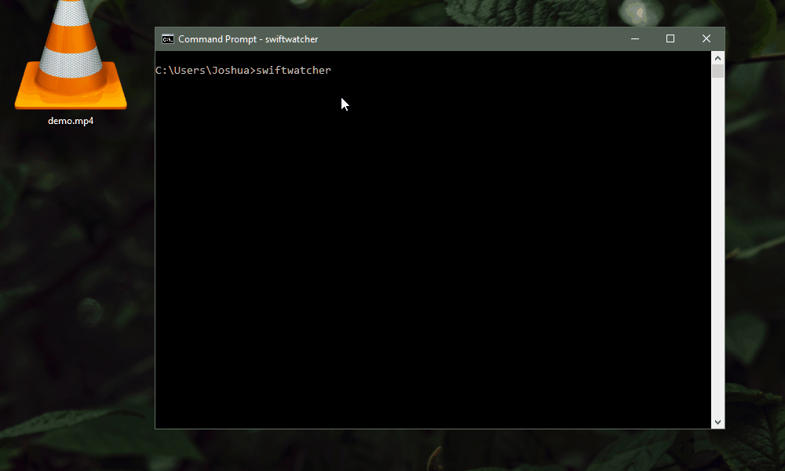

# swiftwatcher
> A collaboration between the University of Victoria's Computer Vision 
Lab and Algoma SwiftWatch

`swiftwatcher` is a open-source tool written in Python which 
automatically counts chimney swifts in video files _(so you don't have 
to!)_ It uses ideas from the field of computer vision to locate and 
track birds within a video's frames, and detect when a bird has entered 
a chimney.

## Getting Started

#### Download

Please visit the 
[Releases](https://github.com/joshuacwnewton/swiftwatcher/releases) page
to download the newest release.
 * `swiftwatcher` for Linux-based 
operating systems
 * `swiftwatcher.exe` for Windows-based operating systems.

#### Usage

Once downloaded, make sure you've put each video you want to
analyse into a single folder. Then, open up a terminal/command-line in 
the directory which the `swiftwatcher` application is saved to and type

```
.\swiftwatcher
``` 
for Linux-based operating systems, or
```
swiftwatcher.exe
```
for Windows-based operating systems.

Doing so will prompt you to select a video directory, so choose the 
folder which contains the videos you want to analyse. Once selected, 
the application will prompt you to select the two corners of the 
chimney within each video. Once selected and confirmed with the `'y'` 
key, the application will proceed to process each video file.



Results will be outputted to a folder of the same name as the video 
file. Within this folder, you will find `.csv` files in a number of 
different time formats. Each contains three columns: 

* **TMSTAMP:** The in-video timestamp corresponding to the counted 
swifts.
* **PREDICTED:** What the application counts as a swift entering the 
chimney.
* **REJECTED:** A potential event that did not meet the 
necessary criteria to be counted.

Counts are only determined from **PREDICTED** swifts, but **REJECTED**
counts are included for transparency. 

## Links

An in-progress research paper will linked shortly. For more information
about the theoretical ideas behind this approach, be sure to check back
soon.

## License

This project is licensed under the GNU General Public License v3.0. To
view the text version of this license, please refer to the `LICENSE`
file included in this project's repository.

